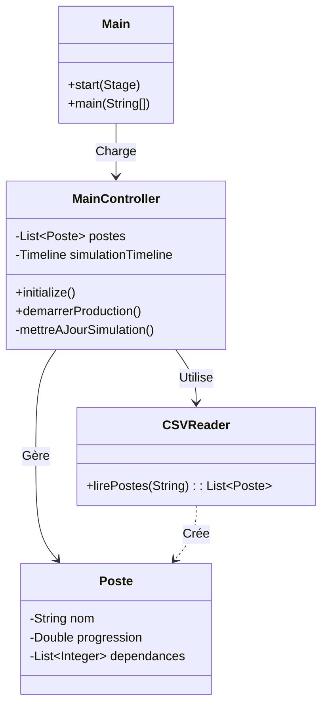

# Rapport de Projet : CesiBike - Gestion d'Atelier

## 1. Introduction

### 1.1 Contexte
Dans le cadre de notre deuxième année, nous avons du réaliser le projet **CesiBike**. Il s'agit d'une application de gestion pour une usine d'assemblage de vélos. L'objectif principal est de fournir une interface graphique permettant de suivre l'avancement de la production sur les différents postes de travail en temps réel.

### 1.2 Objectifs
L'application doit répondre a plusieurs besoins :
*   **Visualisation** : Afficher l'état de chaque poste (opérateur, progression).
*   **Gestion des Données** : Importer la configuration de l'atelier depuis un fichier CSV.
*   **Simulation** : Simuler la production avec des indicateurs visuels.
*   **Contraintes** : Respecter les dépendances entre les taches (ex: le montage des roues ne peut commencer que si le cadre est prêt).

---

## 2. Architecture Logicielle

### 2.1 Le Modèle MVC
Pour structurer notre code, nous avons utilisé le patron de conception **MVC** (Modèle-Vue-Contrôleur). Cela permet de bien séparer les responsabilités et de rendre le code plus lisible.

*   **Modèle** : Contient les données et la logique.
    *   `Poste` : Représente un poste de travail.
    *   `Operateur` : Les infos sur la personne.
*   **Vue** : L'interface utilisateur en **FXML**.
    *   `main.fxml` : La fenêtre principale avec la grille.
*   **Contrôleur** : Fait le lien entre les deux.
    *   `MainController` : Gère l'initialisation et la boucle de simulation.

### 2.2 Diagramme de Classes
Voici le diagramme de classes simplifié de notre solution :



---

## 3. Fonctionnalités Développées

### 3.1 Importation des Données (CSV)
Nous avons développé une classe `CSVReader` pour lire le fichier `poste.csv`. Le format des données étant un peu complexe (avec des crochets `[]` pour les pièces), nous avons utilisé des **Expressions Régulières (Regex)** pour extraire les informations correctement.
Cela nous a permis de récupérer le nom du poste, l'opérateur et les étapes de fabrication.

### 3.2 Gestion des Dépendances
Une fonctionnalité importante est la gestion des blocages. Certains postes ne peuvent pas démarrer tant que les postes précédents n'ont pas terminé leur travail.
Dans le contrôleur, nous vérifions a chaque étape si les dépendances sont satisfaites (progression à 100%). Si ce n'est pas le cas, le poste reste bloqué et grisé pour l'utilisateur.

### 3.3 Simulation de Production
Pour simuler l'activité de l'usine, nous avons mis en place un système de progression aléatoire. Les barres de chargement avancent petit à petit pour imiter le temps de travail réel. Une fois la tache finie, la barre change de couleur.

---

## 4. Multithreading et Concurrence

Cette partie a été la plus complexe du projet. Il fallait gérer l'exécution des tâches sans bloquer l'interface graphique.

### 4.1 Le problème du Thread Unique
En JavaFX, comme dans beaucoup de frameworks, il n'y a qu'un seul thread pour gérer l'affichage (le **Application Thread**). Si on effectue des calculs longs ou des boucles infinies directement dans ce thread, l'application "gèle" et ne répond plus aux clics de la souris.
Nous avons rencontré ce problème au début en essayant de faire une boucle `while` simple.

### 4.2 Notre Solution : La classe `Timeline`
Pour résoudre ce problème, nous avons choisi d'utiliser la classe `Timeline` de JavaFX.
Bien que ce ne soit pas du multithreading au sens strict (création de nouveaux threads CPU), cela permet d'exécuter du code de manière asynchrone par rapport aux actions de l'utilisateur.

```java
// Exemple d'utilisation dans MainController
simulationTimeline = new Timeline(new KeyFrame(Duration.millis(500), e -> mettreAJourSimulation()));
simulationTimeline.setCycleCount(Timeline.INDEFINITE);
simulationTimeline.play();
```

La `Timeline` déclenche la méthode `mettreAJourSimulation` toutes les 500ms. Comme cette méthode est courte (juste incrémenter une valeur), elle ne bloque pas l'interface. Cela donne l'illusion que tout tourne en même temps.

### 4.3 Alternative avec `Task`
Si nous avions eu des calculs beaucoup plus lourds a faire, la `Timeline` n'aurait pas suffit car elle utilise quand même le thread principal.
Il aurait fallu utiliser la classe `Task` et lancer un vrai Thread séparé :
```java
Task<Void> task = new Task<Void>() {
    @Override protected Void call() throws Exception {
        // Calculs lourds ici
        return null;
    }
};
new Thread(task).start();
```
Cependant, pour modifier l'interface depuis ce thread, il faut obligatoirement utiliser `Platform.runLater()`, sinon on obtient une erreur `IllegalStateException`.
Pour notre projet, la `Timeline` était la solution la plus adaptée et la plus simple a mettre en œuvre.

---

## 5. Conclusion

Ce projet nous a permis de mettre en pratique les notions vues en cours, notamment le MVC et la gestion des événements.
Nous avons compris l'importance de ne pas bloquer le thread principal pour garder une application fluide.
Même si notre simulation est basique, elle respecte bien les contraintes de dépendances demandées.

Pour améliorer le projet, nous pourrions ajouter une base de données pour sauvegarder les résultats de la production.

---
*Rapport réalisé par le binôme.*
